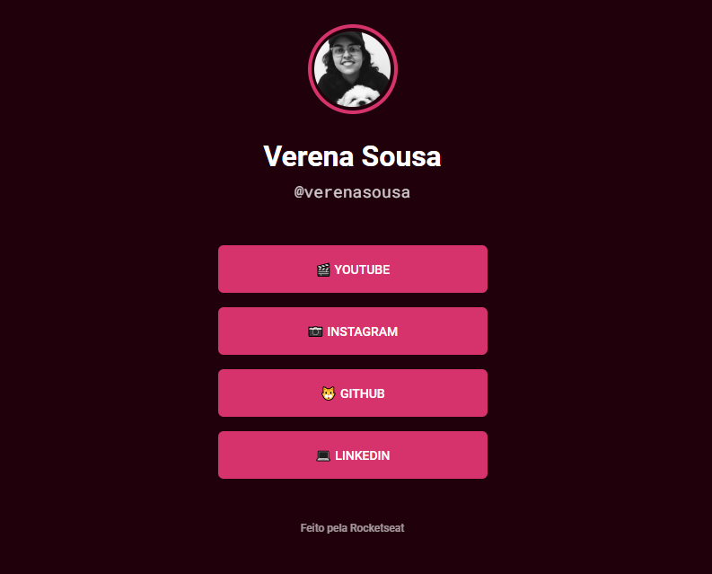

<h1>Maratona Explorer 2.0</h1>

<h2>Links Redes Sociais</h2>

<h3><strong> Tecnologias usadas no Projeto </strong></h3>

<ul>

<li>HTML</li>

<li>CSS</li>

</ul>

<h3><strong>Aprendizado: </strong></h3>

<ul>

<li>Como criar variáveis no CSS</li>

<li>Como publicar a pagina no GitHub pages</li>

<li>Propriedades do Flexbox</li>

<li>Criação de novos temas para o projeto</li>

</ul>